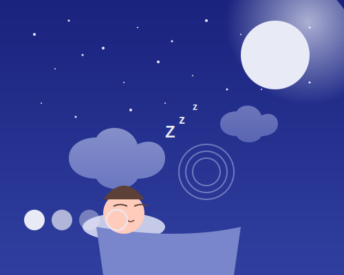

# 梦境守护者 - AI智能助眠网站



## 项目介绍

梦境守护者是一个现代化的AI助眠网站，旨在通过人工智能技术为用户提供个性化的睡眠解决方案。网站结合了自然音效、AI生成内容、睡眠分析和智能闹钟等功能，帮助用户改善睡眠质量。

## 主要功能

- **自然音效**: 高品质的自然环境音效，包括雨声、海浪、森林和风声等
- **AI生成内容**: 由人工智能生成的冥想引导和放松故事
- **睡眠分析**: 追踪和分析用户的睡眠模式，提供个性化建议
- **智能闹钟**: 在浅睡眠阶段唤醒用户，使其更精神焕发
- **声音混合器**: 组合多种声音创建个性化的助眠环境
- **AI助眠伴侣**: 智能对话助手，提供睡眠建议和放松指导

## 技术实现

本项目使用纯HTML、CSS和JavaScript实现，无需额外的依赖或框架。网站具有响应式设计，可以在各种设备上良好显示。

主要技术特点：
- 响应式设计，适配各种屏幕尺寸
- 音频处理和混合功能
- 使用CSS变量便于主题定制
- 使用JavaScript实现交互功能
- SVG矢量图形确保在各种分辨率下的清晰显示

## 如何运行

1. 克隆或下载项目到本地
2. 使用任何现代浏览器打开`index.html`文件
3. 或者将项目部署到任何Web服务器上

## 目录结构

```
ai-sleep-aid/
|-- index.html              # 网站主页
|-- README.md               # 项目说明文档
|-- assets/
    |-- css/
        |-- style.css       # 样式文件
    |-- js/
        |-- main.js         # JavaScript主文件
    |-- images/
        |-- ai-avatar.svg   # AI助手头像
        |-- sleep-illustration.svg # 睡眠插图
    |-- sounds/
        |-- (音频文件存放位置)
```

## 未来计划

- 添加更多种类的自然音效和冥想指导
- 实现用户账户系统，保存个人设置和偏好
- 开发移动应用版本
- 集成更先进的AI模型提供更个性化的睡眠建议
- 添加社区功能，分享睡眠技巧和体验

## 许可证

MIT © 2025 梦境守护者

---

*注意：项目中的音频文件需要单独下载或录制，本模板中未包含实际音频文件。* 